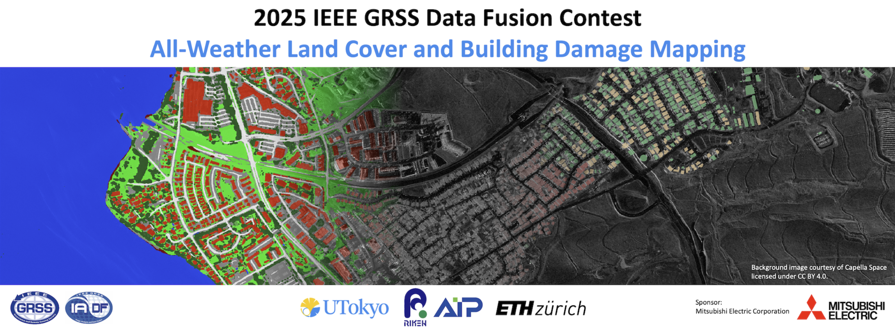

<div align="center">
<h1 align="center">☀️BRIGHT☀️</h1>

<h3>BRIGHT: A globally distributed multimodal VHR dataset for all-weather disaster response</h3>


[Hongruixuan Chen](https://scholar.google.ch/citations?user=XOk4Cf0AAAAJ&hl=zh-CN&oi=ao)<sup>1,2</sup>, [Jian Song](https://scholar.google.ch/citations?user=CgcMFJsAAAAJ&hl=zh-CN)<sup>1,2</sup>, [Olivier Dietrich](https://scholar.google.ch/citations?user=st6IqcsAAAAJ&hl=de)<sup>3</sup>, [Clifford Broni-Bediako](https://scholar.google.co.jp/citations?user=Ng45cnYAAAAJ&hl=en)<sup>2</sup>, [Weihao Xuan](https://scholar.google.com/citations?user=7e0W-2AAAAAJ&hl=en)<sup>1,2</sup>, [Junjue Wang](https://scholar.google.com.hk/citations?user=H58gKSAAAAAJ&hl=en)<sup>1</sup>  
[Xinlei Shao](https://scholar.google.com/citations?user=GaRXJFcAAAAJ&hl=en)<sup>1</sup>, [Yimin Wei](https://www.researchgate.net/profile/Yimin-Wei-9)<sup>1,2</sup>, [Junshi Xia](https://scholar.google.com/citations?user=n1aKdTkAAAAJ&hl=en)<sup>3</sup>, [Cuiling Lan](https://scholar.google.com/citations?user=XZugqiwAAAAJ&hl=zh-CN)<sup>4</sup>, [Konrad Schindler](https://scholar.google.com/citations?user=FZuNgqIAAAAJ&hl=en)<sup>3</sup>, [Naoto Yokoya](https://scholar.google.co.jp/citations?user=DJ2KOn8AAAAJ&hl=en)<sup>1,2 *</sup>


<sup>1</sup> The University of Tokyo, <sup>2</sup> RIKEN AIP,  <sup>3</sup> ETH Zurich,  <sup>4</sup> Microsoft Research Asia

[](https://arxiv.org/abs/2501.06019)  [](https://codalab.lisn.upsaclay.fr/competitions/21122) [](https://zenodo.org/records/14619797)   [](https://huggingface.co/datasets/Kullervo/BRIGHT) 


</div>

## 🛎️Updates
* **` Notice☀️☀️`**: The [full version of the BRIGHT paper](https://arxiv.org/abs/2501.06019) is now online. 
* **` Aug 12th, 2025`**: You can check winners' solutions by visiting their Github repos: [1st rank](https://github.com/Henryjiepanli/Building-Guided-Pseudo-Label-Learning-for-Cross-Modal-Building-Damage-Mapping) and [2nd rank](https://github.com/zxqyiyang/DF2025)!!
* **` Apr 28th, 2025`**: IEEE GRSS DFC 2025 Track II is over. Congratulations to [winners](https://www.grss-ieee.org/community/technical-committees/winners-of-the-2025-ieee-grss-data-fusion-contest-all-weather-land-cover-and-building-damage-mapping/)!! You can now download the full version of DFC 2025 Track II data in [Zenodo](https://zenodo.org/records/14619797) or [HuggingFace](https://huggingface.co/datasets/Kullervo/BRIGHT)!!
* **` Jan 13th, 2025`**: The benchmark code for IEEE GRSS DFC 2025 Track II is now available. Please follow the [**instruction**](#%EF%B8%8Flets-get-started-with-dfc-2025) to use it!! Also, you can find dataset and code related to Track I in [here](https://github.com/cliffbb/DFC2025-OEM-SAR-Baseline)!! 

## 🔭Overview

* [**BRIGHT**](https://arxiv.org/abs/2501.06019) also serves the official dataset of [2025 IEEE GRSS Data Fusion Contest](https://www.grss-ieee.org/technical-committees/image-analysis-and-data-fusion/?tab=working-groups): All-Weather Land Cover and Building Damage Mapping. 


* Although the DFC25 has concluded, we have retained the relevant code and dataset splits to support your research if you wish to continue working within the DFC25 setting. Specifically, **nine** events are designated for training and validation, while **two** events (Noto-Earthquake-2024 and Marshall-Wildfire-2021) are reserved unseen for testing.


<p align="center">
  
</p>


## 🗝️Let's Get Started with DFC 2025!
### `A. Preparation`

Note that the code in this repo runs under **Linux** system. We have not tested whether it works under other OS.

**Step 1: Clone the repository:**

Clone this repository and navigate to the project directory:
```bash
git clone https://github.com/ChenHongruixuan/BRIGHT.git
cd BRIGHT
```

**Step 2: Environment Setup:**

It is recommended to set up a conda environment and installing dependencies via pip. Use the following commands to set up your environment:

***Create and activate a new conda environment***

```bash
conda create -n bright-benchmark
conda activate bright-benchmark
```

***Install dependencies***

```bash
pip install -r requirements.txt
```


### `B. Data Preparation`
Please download the BRIGHT from [Zenodo](https://zenodo.org/records/14619797) or [HuggingFace](https://huggingface.co/datasets/Kullervo/BRIGHT). Note that **`you don't need data over Ukraine, Myanmar, and Mexico under DFC 25 setup`**.

After the data has been prepared, please make them have the following folder/file structure:
```
${DATASET_ROOT}   # Dataset root directory, for example: /home/username/data/bright
│
├── pre-event
│    ├──bata-explosion_00000000_pre_disaster.tif
│    ├──bata-explosion_00000001_pre_disaster.tif
│    ├──bata-explosion_00000002_pre_disaster.tif
│   ...
│
├── post-event
│    ├──bata-explosion_00000000_post_disaster.tif
│    ... 
│
└── target
     ├──bata-explosion_00000000_building_damage.tif 
     ...   
```

### `C. Model Training & Tuning`

The following commands show how to train and evaluate UNet on the BRIGHT dataset using DFC25 split set in [`bda_benchmark/dataset/splitname/dfc25`]:

```bash
python script/standard_ML/train_UNet.py --dataset 'BRIGHT' \
                                        --train_batch_size 16 \
                                        --eval_batch_size 4 \
                                        --num_workers 16 \
                                        --crop_size 640 \
                                        --max_iters 800000 \
                                        --learning_rate 1e-4 \
                                        --model_type 'UNet' \
                                        --model_param_path '<your model checkpoint saved path>' \
                                        --train_dataset_path '<your dataset path>' \
                                        --train_data_list_path '<your project path>/bda_benchmark/dataset/splitname/dfc25/train_set.txt' \
                                        --val_dataset_path '<your dataset path>' \
                                        --val_data_list_path '<your project path>/bda_benchmark/dataset/splitname/dfc25/holdout_set.txt' \
                                        --test_dataset_path '<your dataset path>' \
                                        --test_data_list_path '<your project path>/bda_benchmark/dataset/splitname/dfc25/val_set.txt' 
```


### `D. Inference & Evaluation`
The following commands show how to evaluate trained UNet on the two unseen events:
```bash
python script/standard_ML/infer_UNet.py --model_path  '<path of the checkpoint of model>' \
                                        --test_dataset_path '<your dataset path>' \
                                        --test_data_list_path '<your project path>/bda_benchmark/dataset/splitname/dfc25/test_set.txt' \
                                        --output_dir '<your inference results saved path>'
```

Then, you can still go to the official [Leaderboard](https://codalab.lisn.upsaclay.fr/competitions/21122) in CodaLab to submit your results. 

* `Keep the prediction name consistent with label name, i.e., turkey-earthquake_00000001_building_damage.png, hawaii-wildfire_00000003_building_damage.png, and so on.`
* `All png files should be submitted in zip file format. Zip all prediction files directly without any folders containing them.`
* `Using the raw prediction results instead of visualized ones.`

## 🤔Common Issues
Based on peers' questions from [issue section](https://github.com/ChenHongruixuan/BRIGHT/issues), here's a quick navigate list of solutions to some common issues.

| Issue | Solution | 
| :---: | :---: | 
|  Abnormal accuracy (like 0 or -999999) given by leaderboard   |   Keep the prediction name and label name consistent / Zip all prediction files directly, not the folder containing them     |
|  Leaderboard server not responding after submitting results   |   Change browser (Google Chrome recommended)     |
|  Python package conflicts   |   The baseline code is not limited to a specific version, and participants do not need to match the version we provide.     |


## 📜Reference

If this dataset or code contributes to your research, please kindly consider citing our paper and give this repo ⭐️ :)
```
@article{chen2025bright,
      title={BRIGHT: A globally distributed multimodal building damage assessment dataset with very-high-resolution for all-weather disaster response}, 
      author={Hongruixuan Chen and Jian Song and Olivier Dietrich and Clifford Broni-Bediako and Weihao Xuan and Junjue Wang and Xinlei Shao and Yimin Wei and Junshi Xia and Cuiling Lan and Konrad Schindler and Naoto Yokoya},
      journal={arXiv preprint arXiv:2501.06019},
      year={2025},
      url={https://arxiv.org/abs/2501.06019}, 
}
```


## 🤝Acknowledgments
The authors would also like to give special thanks to [Sarah Preston](https://www.linkedin.com/in/sarahjpreston/) of Capella Space, [Capella Space's Open Data Gallery](https://www.capellaspace.com/earth-observation/gallery), [Maxar Open Data Program](https://www.maxar.com/open-data) and [Umbra Space's Open Data Program](https://umbra.space/open-data/) for providing the valuable data.

## 🙋Q & A
***For any questions, please feel free to leave it in the [issue section](https://github.com/ChenHongruixuan/BRIGHT/issues) or [contact us.](mailto:Qschrx@gmail.com)***