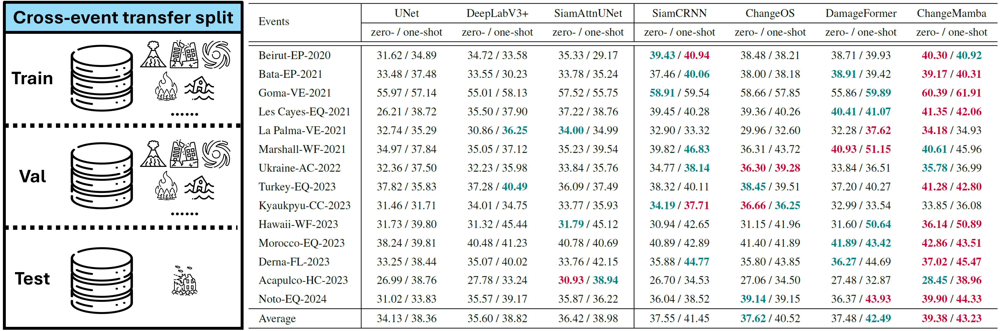

<div align="center">
<h1 align="center">☀️BRIGHT☀️</h1>

<h3>BRIGHT: A globally distributed multimodal VHR dataset for all-weather disaster response</h3>


[Hongruixuan Chen](https://scholar.google.ch/citations?user=XOk4Cf0AAAAJ&hl=zh-CN&oi=ao)<sup>1,2</sup>, [Jian Song](https://scholar.google.ch/citations?user=CgcMFJsAAAAJ&hl=zh-CN)<sup>1,2</sup>, [Olivier Dietrich](https://scholar.google.ch/citations?user=st6IqcsAAAAJ&hl=de)<sup>3</sup>, [Clifford Broni-Bediako](https://scholar.google.co.jp/citations?user=Ng45cnYAAAAJ&hl=en)<sup>2</sup>, [Weihao Xuan](https://scholar.google.com/citations?user=7e0W-2AAAAAJ&hl=en)<sup>1,2</sup>, [Junjue Wang](https://scholar.google.com.hk/citations?user=H58gKSAAAAAJ&hl=en)<sup>1</sup>  
[Xinlei Shao](https://scholar.google.com/citations?user=GaRXJFcAAAAJ&hl=en)<sup>1</sup>, [Yimin Wei](https://www.researchgate.net/profile/Yimin-Wei-9)<sup>1,2</sup>, [Junshi Xia](https://scholar.google.com/citations?user=n1aKdTkAAAAJ&hl=en)<sup>3</sup>, [Cuiling Lan](https://scholar.google.com/citations?user=XZugqiwAAAAJ&hl=zh-CN)<sup>4</sup>, [Konrad Schindler](https://scholar.google.com/citations?user=FZuNgqIAAAAJ&hl=en)<sup>3</sup>, [Naoto Yokoya](https://scholar.google.co.jp/citations?user=DJ2KOn8AAAAJ&hl=en)<sup>1,2 *</sup>


<sup>1</sup> The University of Tokyo, <sup>2</sup> RIKEN AIP,  <sup>3</sup> ETH Zurich,  <sup>4</sup> Microsoft Research Asia

[](https://arxiv.org/abs/2501.06019)   [](https://zenodo.org/records/14619797)   [](https://huggingface.co/datasets/Kullervo/BRIGHT) 


</div>

## 🛎️Updates
* **` Notice☀️☀️`**: The [full version of the BRIGHT paper](https://arxiv.org/abs/2501.06019) are now online. Related data and benchmark suites will be released soon!!
* **` May 5th, 2025`**: The code for cross-event transfer has been uploaded!!

## 🔭Overview

* [**BRIGHT**](https://arxiv.org/abs/2501.06019) also supports the cross-event transfer setup to better evaluate the ability of models to generalize across disaster events. 


* Zero-shot setup: This setting mimics a real-world scenario where a newly occurring disaster must be analyzed without any prior labeled data from the same event. We isolate one event as an unseen test set while using the remaining 13 events for training and validation. 

* One-shot setup: In this setting, a limited subset of labeled data (one pair for training and one pair for validation) from the target disaster event is incorporated into the training process, while the test set remains unseen. 

* The unsupervised domain adaptation (UDA) and semi-supervised learning (SSL) methods naturally emerge as promising strategies to bridge the domain gap between the source and the target disaster events. In the zero-shot setting, UDA methods aim to improve model generalization by aligning the source and target domains without requiring any target labels. In the one-shot setting, SSL methods leverage a small number of labeled samples with abundant unlabeled data from the target event.

<p align="center">
  
</p>


## 🗝️Let's Get Started with Cross-Event Transfer!
### `A. Preparation`

Note that the code in this repo runs under **Linux** system. We have not tested whether it works under other OS.

**Step 1: Clone the repository:**

Clone this repository and navigate to the project directory:
```bash
git clone https://github.com/ChenHongruixuan/BRIGHT.git
cd BRIGHT
```

**Step 2: Environment Setup:**

It is recommended to set up a conda environment and installing dependencies via pip. Use the following commands to set up your environment:

***Create and activate a new conda environment***

```bash
conda create -n bright-benchmark
conda activate bright-benchmark
```

***Install dependencies***

```bash
pip install -r requirements.txt
```


### `B. Data Preparation`
Please download the BRIGHT from [Zenodo](https://zenodo.org/records/14619797) or [HuggingFace](https://huggingface.co/datasets/Kullervo/BRIGHT). Note that we cannot redistribute the optical data over Ukraine, Myanmar, and Mexico. Please follow our [tutorial](../tutorial.md) to download and preprocess them. 

After the data has been prepared, please make them have the following folder/file structure:
```
${DATASET_ROOT}   # Dataset root directory, for example: /home/username/data/bright
│
├── pre-event
│    ├──bata-explosion_00000000_pre_disaster.tif
│    ├──bata-explosion_00000001_pre_disaster.tif
│    ├──bata-explosion_00000002_pre_disaster.tif
│   ...
│
├── post-event
│    ├──bata-explosion_00000000_post_disaster.tif
│    ... 
│
└── target
     ├──bata-explosion_00000000_building_damage.tif 
     ...   
```

### `C. Zero-shot Cross-Event Transfer`

The following commands show how to train and evaluate [SiamCRNN](https://ieeexplore.ieee.org/abstract/document/8937755) under **zero-shot** cross-event transfer, where the `--test_event_name` flag specifies the prefix of the target disaster event used exclusively for testing. In the example below, **congo-volcano**  is used as the target event:

```bash
python script/cross_event/zero_shot/train_SiamCRNN.py --dataset 'BRIGHT' \
                                                      --train_batch_size 16 \
                                                      --eval_batch_size 4 \
                                                      --num_workers 16 \
                                                      --crop_size 640 \
                                                      --max_iters 800000 \
                                                      --learning_rate 1e-4 \
                                                      --model_type 'SiamCRNN-ZeroShot-congo-volcano' \
                                                      --model_param_path '<your model checkpoint saved path>' \
                                                      --train_dataset_path '<your dataset path>' \
                                                      --train_data_list_path '<your project path>/bda_benchmark/dataset/splitname/standard_ML/train_set.txt' \
                                                      --val_dataset_path '<your dataset path>' \
                                                      --val_data_list_path '<your project path>/bda_benchmark/dataset/splitname/standard_ML/val_set.txt' \
                                                      --test_dataset_path '<your dataset path>' \
                                                      --test_data_list_path '<your project path>/bda_benchmark/dataset/splitname/standard_ML/test_set.txt' \
                                                      --test_event_name 'congo-volcano'
```

The following commands show how to train and evaluate unsupervised domain adaptation method [AdaptSeg](https://openaccess.thecvf.com/content_cvpr_2018/papers/Tsai_Learning_to_Adapt_CVPR_2018_paper.pdf) on the BRIGHT dataset under **zero-shot cross-event transfer**:
```bash
python script/cross_event/zero_shot/AdaptSeg.py --dataset 'BRIGHT' \
                                                --train_batch_size 16 \
                                                --eval_batch_size 4 \
                                                --num_workers 16 \
                                                --crop_size 640 \
                                                --max_iters 800000 \
                                                --learning_rate_seg 1e-4 \
                                                --learning_rate_dis 1e-4 \
                                                --model_type 'AdaptSeg-Zero-Shot-congo-volcano' \
                                                --model_param_path '<your model checkpoint saved path>' \
                                                --train_dataset_path '<your dataset path>' \
                                                --train_data_list_path '<your project path>/bda_benchmark/dataset/splitname/standard_ML/train_set.txt' \
                                                --val_dataset_path '<your dataset path>' \
                                                --val_data_list_path '<your project path>/bda_benchmark/dataset/splitname/standard_ML/val_set.txt' \
                                                --test_dataset_path '<your dataset path>' \
                                                --test_data_list_path '<your project path>/bda_benchmark/dataset/splitname/standard_ML/test_set.txt' 
```


### `D. One-shot Cross-Event Transfer`
The following commands show how to train and evaluate [DamageFormer](https://arxiv.org/abs/2201.10953) under **one-shot** cross-event transfer:

```bash
python script/cross_event/one_shot/train_DamageFormer.py  --dataset 'BRIGHT' \
                                                          --train_batch_size 16 \
                                                          --eval_batch_size 4 \
                                                          --num_workers 16 \
                                                          --crop_size 640 \
                                                          --max_iters 800000 \
                                                          --learning_rate 1e-4 \
                                                          --weight_decay 5e-3 \
                                                          --model_type 'DamageFormer-OneShot-hawaii-wildfire' \
                                                          --model_param_path '<your model checkpoint saved path>' \
                                                          --train_dataset_path '<your dataset path>' \
                                                          --train_data_list_path '<your project path>/bda_benchmark/dataset/splitname/standard_ML/train_set.txt' \
                                                          --val_dataset_path '<your dataset path>' \
                                                          --val_data_list_path '<your project path>/bda_benchmark/dataset/splitname/standard_ML/val_set.txt' \
                                                          --test_dataset_path '<your dataset path>' \
                                                          --test_data_list_path '<your project path>/bda_benchmark/dataset/splitname/standard_ML/test_set.txt' \
                                                          --train_data_list_path_few_shot '<your project path>/bda_benchmark/dataset/splitname/few_shot/train_set.txt' \
                                                          --val_data_list_path_few_shot '<your project path>/bda_benchmark/dataset/splitname/few_shot/val_set.txt' \
                                                          --test_event_name 'hawaii-wildfire'
```

The following commands show how to train and evaluate semi-supervised learning method [Mean Teacher](https://proceedings.neurips.cc/paper_files/paper/2017/file/68053af2923e00204c3ca7c6a3150cf7-Paper.pdf) under **one-shot** cross-event transfer:

```bash
python script/cross_event/one_shot/train_MeanTeacher.py --dataset 'BRIGHT' \
                                                        --train_batch_size 16 \
                                                        --eval_batch_size 4 \
                                                        --num_workers 16 \
                                                        --crop_size 640 \
                                                        --max_iters 800000 \
                                                        --learning_rate 1e-4 \
                                                        --model_type 'MeanTeacher-OneShot-hawaii-wildfire' \
                                                        --model_param_path '<your model checkpoint saved path>' \
                                                        --train_dataset_path '<your dataset path>' \
                                                        --train_data_list_path '<your project path>/bda_benchmark/dataset/splitname/standard_ML/train_set.txt' \
                                                        --val_dataset_path '<your dataset path>' \
                                                        --val_data_list_path '<your project path>/bda_benchmark/dataset/splitname/standard_ML/val_set.txt' \
                                                        --test_dataset_path '<your dataset path>' \
                                                        --test_data_list_path '<your project path>/bda_benchmark/dataset/splitname/standard_ML/test_set.txt' \
                                                        --train_data_list_path_few_shot '<your project path>/bda_benchmark/dataset/splitname/few_shot/train_set.txt' \
                                                        --val_data_list_path_few_shot '<your project path>/bda_benchmark/dataset/splitname/few_shot/val_set.txt' \
                                                        --test_event_name 'hawaii-wildfire'
```


## 📜Reference

If this dataset or code contributes to your research, please kindly consider citing our paper and give this repo ⭐️ :)
```
@article{chen2025bright,
      title={BRIGHT: A globally distributed multimodal building damage assessment dataset with very-high-resolution for all-weather disaster response}, 
      author={Hongruixuan Chen and Jian Song and Olivier Dietrich and Clifford Broni-Bediako and Weihao Xuan and Junjue Wang and Xinlei Shao and Yimin Wei and Junshi Xia and Cuiling Lan and Konrad Schindler and Naoto Yokoya},
      journal={arXiv preprint arXiv:2501.06019},
      year={2025},
      url={https://arxiv.org/abs/2501.06019}, 
}
```

## 🤝Acknowledgments
The UDA code is based on [AdaptSeg](https://github.com/wasidennis/AdaptSegNet). The SSL code is based on [TorchSemiSeg](https://github.com/charlesCXK/TorchSemiSeg). Many thanks for their brilliant work!!

## 🙋Q & A
***For any questions, please feel free to leave it in the [issue section](https://github.com/ChenHongruixuan/BRIGHT/issues) or [contact us.](mailto:Qschrx@gmail.com)***
