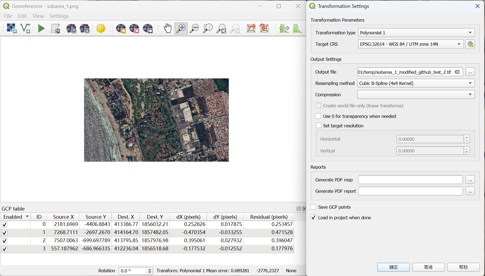

## 📡 Optical Image Preprocessing Tutorial

This tutorial describes the step-by-step process to **acquire** and **preprocess** optical images over **Ukraine, Myanmar, and Mexico** in BRIGHT. First, please make sure you have downloaded BRIGHT from [Zenodo](https://zenodo.org/records/15335889) or [HuggingFace](https://huggingface.co/datasets/Kullervo/BRIGHT). 

### `A. Downloading Optical Imagery`

1. **Load KMZ and adjust view**
    - Open [Google Earth Pro](https://www.google.com/earth/versions/#earth-pro).
    - Import the provided `.kmz` file (`File > Open`) to visualize the target locations.
    - Use the **historical imagery** slider in Google Earth Pro to select a date **prior to the disaster** event. This ensures that the image represents the **pre-disaster** condition. The required timestamp is embedded in the `.kmz` file name (e.g., `Mexico_Hurricane_AOI01A_pre_disaster_202305_range.kmz` → set the view to a date **on 2023-05**)
    - Zoom in/out to set a consistent **spatial scale** across all locations.
    - Select **distinct feature points** (e.g., road crossings, building corners) and drop **yellow placemarks** (as shown below) — these will be used for later georeferencing. To simplify this step, we also provide **pre-selected Ground Control Points (GCPs)** for each sub-image (e.g., `Mexico_Hurricane_AOI01_pre_disaster_202305_feature_point.kmz`). You can directly import these into QGIS Georeferencer instead of manually selecting them.

  

2. **Save imagery**
    - Turn off labels and layers to clean up the view.
    - Export each image via `File > Save > Save Image…`.
    - ⚠️ **Note:** To improve spatial resolution, you may choose to save **multiple overlapping sub-images** covering the same region at a higher zoom level. However, each sub-image must be **individually registered in QGIS** using manually selected Ground Control Points (GCPs).

### `B. Image Georeferencing`
1. **Open QGIS and launch the Georeferencer**
   - Start QGIS.
   - Go to `Raster > Georeferencer` to open the Georeferencer tool.

2. **Load the raw (unreferenced) image**
   - In Georeferencer, click `File > Open Raster` and select the image you saved from Google Earth.

3. **Load a base map for georeferencing**
   - In the main QGIS window (not Georeferencer), load a **web map base layer** with accurate geographic coordinates.
   - We recommend using the **Google Satellite** layer:
     - You can add it using the [QuickMapServices plugin](https://plugins.qgis.org/plugins/quick_map_services/):
       - Install it via `Plugins > Manage and Install Plugins`.
       - Once installed, go to `Web > QuickMapServices > Google > Google Satellite`.

4. **Assign Ground Control Points (GCPs)**
   - In the Georeferencer window, use the `Add Point` tool to click a location in the image, then select the **corresponding point on the QGIS map canvas** (where the KMZ is loaded).

5. **Configure transformation settings**
   - Choose a transformation type (e.g., *Polynomial 1*) based on how many points and how warped the image is.
   - Set the resampling method (e.g., *Cubic*).
   - Define the target CRS.
   ### 📏 Target CRS per Region
   | Region Name              | CRS (EPSG)                  |
   |--------------------------|-----------------------------|
   | Myanmar_Hurricane_AOI01  | EPSG:32646 - WGS84          |
   | Mexico_Hurricane_AOI01   |    EPSG: 32614 -WGS84       |
   | Mexico_Hurricane_AOI02   |    EPSG: 32614 -WGS84       |
   | Ukraine_Conflict_AOI01   |    EPSG: 32637 -WGS84       |
   | Ukraine_Conflict_AOI02   |    EPSG: 32637 -WGS84       |
   | Ukraine_Conflict_AOI03   |    EPSG: 32636 -WGS84       |

6. **Start georeferencing**
   - Click `Settings > Transformation Settings`, configure output path, and enable `Load in QGIS when done`.
   - Then click the green **"Start Georeferencing"** button to begin.

  

7. **Resample the Georeferenced Image to Match SAR Resolution (QGIS Warp)**

   After registration, use **QGIS's Warp (Reproject)** tool to resample the image to the target resolution.

   **Steps in QGIS:**
   - Go to `Raster > Projections > Warp (Reproject)`
   - Select your `.tif` image as input
   - Set the **Target CRS** to match your original image
   - Under `Advanced Parameters`, set:
      - **Output file resolution (in target units)**: e.g., `0.3`, `0.5`, etc.
      ### 📏 Spatial Resolution per Region
      | Region Name              |Target Resolution (m/pixel)  |
      |--------------------------|-----------------------------|
      | Myanmar_Hurricane_AOI01  |     0.35                    |
      | Mexico_Hurricane AOI01   |     0.3                     |
      | Mexico_Hurricane AOI02   |     0.3                     |
      | Ukraine_Conflict AOI01   |     0.35                    |
      | Ukraine_Conflict AOI02   |     0.35                    |
      | Ukraine_Conflict AOI03   |     0.46615                 |
   - Run the tool

7. **Save Georeferenced Image with Standardized Naming**

   - After successful georeferencing and resampling, save the output image with a consistent and descriptive filename. Use the following naming convention. If you are working on the **Mexico Hurricane** dataset, AOI01, and you extracted two overlapping subtiles:
        - `Mexico_Hurricane_AOI01A_pre_disaster.tif`
        - `Mexico_Hurricane_AOI01B_pre_disaster.tif`

   

### `C. Merging Subregions & Cropping Tiles using SAR Data`
Once all sub-images of a given AOI have been georeferenced and saved as `.tif` files with proper naming, you can proceed with merging and cropping.

1. **Merge georeferenced sub-images into one complete image**

    - Run the provided merging script `merge_geotiff.py` to combine multiple `.tif` files (e.g., `AOI01A`, `AOI01B`, etc.) into one seamless georeferenced image per AOI.

2. **Crop the merged image using SAR tile metadata**

    - Run `crop_by_sar.py` to use the provided SAR metadata (e.g., tile centers and extents) to extract matching patches from the merged optical image. 

## 🎬 Tutorial Video

For the above full walkthrough of the optical image preprocessing and alignment workflow, you can also refer to the 📺[video tutorial](https://www.youtube.com/watch?v=USOARDNEdg0&t=753s).

## 🙋Q & A
***For any questions, please feel free to leave it in the [issue section](https://github.com/ChenHongruixuan/BRIGHT/issues) or [contact us.](mailto:Qschrx@gmail.com)***