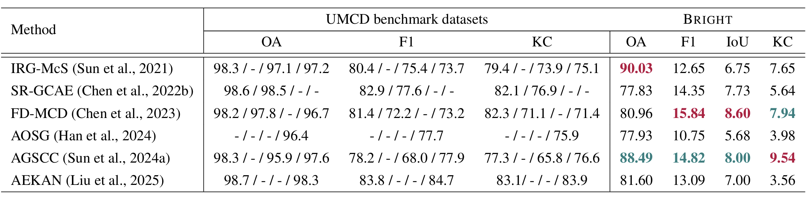

<div align="center">
<h1 align="center">☀️BRIGHT☀️</h1>

<h3>BRIGHT: A globally distributed multimodal VHR dataset for all-weather disaster response</h3>


[Hongruixuan Chen](https://scholar.google.ch/citations?user=XOk4Cf0AAAAJ&hl=zh-CN&oi=ao)<sup>1,2</sup>, [Jian Song](https://scholar.google.ch/citations?user=CgcMFJsAAAAJ&hl=zh-CN)<sup>1,2</sup>, [Olivier Dietrich](https://scholar.google.ch/citations?user=st6IqcsAAAAJ&hl=de)<sup>3</sup>, [Clifford Broni-Bediako](https://scholar.google.co.jp/citations?user=Ng45cnYAAAAJ&hl=en)<sup>2</sup>, [Weihao Xuan](https://scholar.google.com/citations?user=7e0W-2AAAAAJ&hl=en)<sup>1,2</sup>, [Junjue Wang](https://scholar.google.com.hk/citations?user=H58gKSAAAAAJ&hl=en)<sup>1</sup>  
[Xinlei Shao](https://scholar.google.com/citations?user=GaRXJFcAAAAJ&hl=en)<sup>1</sup>, [Yimin Wei](https://www.researchgate.net/profile/Yimin-Wei-9)<sup>1,2</sup>, [Junshi Xia](https://scholar.google.com/citations?user=n1aKdTkAAAAJ&hl=en)<sup>3</sup>, [Cuiling Lan](https://scholar.google.com/citations?user=XZugqiwAAAAJ&hl=zh-CN)<sup>4</sup>, [Konrad Schindler](https://scholar.google.com/citations?user=FZuNgqIAAAAJ&hl=en)<sup>3</sup>, [Naoto Yokoya](https://scholar.google.co.jp/citations?user=DJ2KOn8AAAAJ&hl=en)<sup>1,2 *</sup>


<sup>1</sup> The University of Tokyo, <sup>2</sup> RIKEN AIP,  <sup>3</sup> ETH Zurich,  <sup>4</sup> Microsoft Research Asia

[](https://essd.copernicus.org/articles/17/6217/2025/essd-17-6217-2025.html) [](https://arxiv.org/abs/2501.06019)  [](https://zenodo.org/records/14619797)   [](https://huggingface.co/datasets/Kullervo/BRIGHT) 


</div>

## 🛎️Updates
* **` Notice☀️☀️`**: The [full version of the BRIGHT paper](https://arxiv.org/abs/2501.06019) is now online. Related data and benchmark suites will be released soon!!
* **` Nov 18th, 2025`**: BRIGHT has been accepted by [ESSD and online available](https://essd.copernicus.org/articles/17/6217/2025/essd-17-6217-2025.html) now!!
* **` May 2nd, 2025`**: The code for unsupervised multimodal change detection has been uploaded!!


## 🔭Overview

* [**BRIGHT**](https://arxiv.org/abs/2501.06019) supports the evaluation of **Unsupervised Multimodal Change Detection (UMCD)** algorithms for their performance in large-scale disaster scenarios, thereby providing insights into their robustness and scalability.

* We propose a **standardized and realistic** evaluation strategy for UMCD research, which involves an independent split for training and evaluation. This contrasts with the common practice in UMCD of training, tuning, and evaluating on the same dataset, which can lead to overly optimistic results. 


* For evaluation, we treat **Destroyed** buildings as the positive (changed) class, and all other regions (including intact, damaged, and background) as the unchanged class. This allows a fair adaptation of these methods to a disaster-relevant setting while respecting their original design. 


<p align="center">
  
</p>


## 🗝️Let's Get Started UMCD with BRIGHT!
### `A. Installation`

Note that the code in this repo runs using [MATLAB 2024b](https://jp.mathworks.com/products/new_products/latest_features.html) in **Windows** system. We have not tested whether it works under other OS.

**Step 1: Clone the repository:**

Clone this repository and navigate to the project directory:
```bash
git clone https://github.com/ChenHongruixuan/BRIGHT.git
cd BRIGHT
```

**Step 2: Unzip the code:**

Please unzip [`UMCD_benchmark/IRG-McS_BRIGHT.zip`] for the code of [IRG-McS](https://ieeexplore.ieee.org/document/9477152) and [`UMCD_benchmark/AGSCC_BRIGHT.zip`] for [AGSCC](https://ieeexplore.ieee.org/document/9810207). These two methods are feature transformation and image translation methods, respectively. They are non-deep-learning methods and hence can be run quickly to get detection results.


### `B. Data Preparation`
Please just follow the standard supervised learning's part, download data from [Zenodo](https://zenodo.org/records/14619797) or [HuggingFace](https://huggingface.co/datasets/Kullervo/BRIGHT) and make them have the following folder/file structure:
```
${DATASET_ROOT}   # Dataset root directory, for example: /home/username/data/bright
│ 
├── pre-event
│    ├──bata-explosion_00000000_pre_disaster.tif
│    ├──bata-explosion_00000001_pre_disaster.tif
│    ├──bata-explosion_00000002_pre_disaster.tif
│   ...
│
├── post-event
│    ├──bata-explosion_00000000_post_disaster.tif
│    ... 
│
└── target
     ├──bata-explosion_00000000_building_damage.tif 
    ...   
```

### `C. Running Algorithm`
You can use our provided standard split under the folder [`UMCD_benchmark/splitname`] to tune the parameters of UMCD methods and perform evaluation. In addition, we offer a subset split that excludes data from Ukraine, Myanmar, and Mexico, i.e, data of IEEE GRSS DFC 2025. 

- For IRG-McS, you can directly run `IRGMcS_batch_process_BRIGHT.m`, using `train_umcd.txt` to tune the hyperparameters and `evaluation_umcd.txt` to evaluate the final results. Also, we provide a parallel implementation script `IRGMcS_batch_process_BRIGHT.m` to speed up. 

- For AGSCC, you can directly run `AGSCC_batch_process_BRIGHT.m` and the parallel speedup script `AGSCC_batch_process_BRIGHT_parallel.m` to speed up. 


## 📜Reference

If this dataset or code contributes to your research, please kindly consider citing our paper and give this repo ⭐️ :)
```
@article{chen2025bright,
      title={BRIGHT: A globally distributed multimodal building damage assessment dataset with very-high-resolution for all-weather disaster response}, 
      author={Hongruixuan Chen and Jian Song and Olivier Dietrich and Clifford Broni-Bediako and Weihao Xuan and Junjue Wang and Xinlei Shao and Yimin Wei and Junshi Xia and Cuiling Lan and Konrad Schindler and Naoto Yokoya},
      journal={arXiv preprint arXiv:2501.06019},
      year={2025},
      url={https://arxiv.org/abs/2501.06019}, 
}
```

## 🤝Acknowledgments
The MATLAB code for UMCD is based on [**IRG-McS**](https://github.com/yulisun/IRG-McS) and [**AGSCC**](https://github.com/yulisun/AGSCC). Some other works evaluated in our paper include [**SR-GCAE**](https://ieeexplore.ieee.org/document/9984688), [**FD-MCD**](https://www.sciencedirect.com/science/article/pii/S092427162300062X),  [**AOSG**](https://www.sciencedirect.com/science/article/pii/S1569843223004545), and [**AEKAN**](https://ieeexplore.ieee.org/document/10793414/). Many thanks for their brilliant work!!

## 🙋Q & A
***For any questions, please feel free to leave it in the [issue section](https://github.com/ChenHongruixuan/BRIGHT/issues) or [contact us.](mailto:Qschrx@gmail.com)***