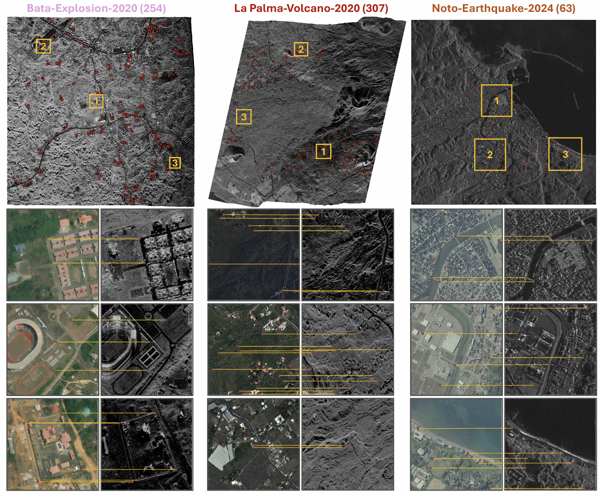

<div align="center">
<h1 align="center">☀️BRIGHT☀️</h1>

<h3>BRIGHT: A globally distributed multimodal VHR dataset for all-weather disaster response</h3>


[Hongruixuan Chen](https://scholar.google.ch/citations?user=XOk4Cf0AAAAJ&hl=zh-CN&oi=ao)<sup>1,2</sup>, [Jian Song](https://scholar.google.ch/citations?user=CgcMFJsAAAAJ&hl=zh-CN)<sup>1,2</sup>, [Olivier Dietrich](https://scholar.google.ch/citations?user=st6IqcsAAAAJ&hl=de)<sup>3</sup>, [Clifford Broni-Bediako](https://scholar.google.co.jp/citations?user=Ng45cnYAAAAJ&hl=en)<sup>2</sup>, [Weihao Xuan](https://scholar.google.com/citations?user=7e0W-2AAAAAJ&hl=en)<sup>1,2</sup>, [Junjue Wang](https://scholar.google.com.hk/citations?user=H58gKSAAAAAJ&hl=en)<sup>1</sup>  
[Xinlei Shao](https://scholar.google.com/citations?user=GaRXJFcAAAAJ&hl=en)<sup>1</sup>, [Yimin Wei](https://www.researchgate.net/profile/Yimin-Wei-9)<sup>1,2</sup>, [Junshi Xia](https://scholar.google.com/citations?user=n1aKdTkAAAAJ&hl=en)<sup>3</sup>, [Cuiling Lan](https://scholar.google.com/citations?user=XZugqiwAAAAJ&hl=zh-CN)<sup>4</sup>, [Konrad Schindler](https://scholar.google.com/citations?user=FZuNgqIAAAAJ&hl=en)<sup>3</sup>, [Naoto Yokoya](https://scholar.google.co.jp/citations?user=DJ2KOn8AAAAJ&hl=en)<sup>1,2 *</sup>


<sup>1</sup> The University of Tokyo, <sup>2</sup> RIKEN AIP,  <sup>3</sup> ETH Zurich,  <sup>4</sup> Microsoft Research Asia

[](https://essd.copernicus.org/articles/17/6217/2025/essd-17-6217-2025.html) [](https://arxiv.org/abs/2501.06019)  [](https://zenodo.org/records/14619797)   [](https://huggingface.co/datasets/Kullervo/BRIGHT) 


</div>

## 🛎️Updates
* **` Notice☀️☀️`**: The [full version of the BRIGHT paper](https://arxiv.org/abs/2501.06019) is now online. Related data and benchmark suites will be released soon!!
* **` Nov 18th, 2025`**: BRIGHT has been accepted by [ESSD and online available](https://essd.copernicus.org/articles/17/6217/2025/essd-17-6217-2025.html) now!!
* **` Apr 28th, 2025`**: The data for unsupervised multimodal image matching has been uploaded to [Zenodo](https://zenodo.org/records/14619797) and [HuggingFace](https://huggingface.co/datasets/Kullervo/BRIGHT)!!


## 🔭Overview

* [**BRIGHT**](https://arxiv.org/abs/2501.06019) supports the evaluation of **Unsupervised Multimodal Image Matching (UMIM)** algorithms for their performance in large-scale disaster scenarios. 

* Due to the lack of real ground truth correspondences, we adopt a proxy evaluation strategy using **manually selected control points** as references. These points are selected by several EO experts to represent clearly identifiable and stable features across modalities. While this does not constitute absolute ground truth, it can still allow us to assess **how closely automated methods approximate human matching ability** under multimodal disaster conditions.
<p align="center">
  
</p>


## 🗝️Let's Get Started UMIM with BRIGHT!
### `A. Installation`

Note that the code in this repo runs using [MATLAB 2024b](https://jp.mathworks.com/products/new_products/latest_features.html) in **Windows** system. We have not tested whether it works under other OS.

**Step 1: Clone the repository:**

Clone this repository and navigate to the project directory:
```bash
git clone https://github.com/ChenHongruixuan/BRIGHT.git
cd BRIGHT
```

**Step 2: Unzip the code:**

Please unzip [`UMIM_benchmark/area_based.zip`] for the code of area-based UMIM methods. 


### `B. Data Preparation`
Please download the unpreprocessed data from [Zenodo](https://zenodo.org/records/14619797) or [HuggingFace](https://huggingface.co/datasets/Kullervo/BRIGHT) and make them have the following folder/file structure:
```
${DATASET_ROOT}   # Dataset root directory, for example: /home/username/data/umim
│
└── umim
     ├── noto_earthquake
     │    ├── Noto_Earthquake_20240101_AOI01A_pre_disaster.tif
     │    ├── Noto_Earthquake_20240101_AOI01A_post_disaster_before_registration.tif
     │    └── Noto_Earthquake_20240101_AOI01A_manual_control_point.txt
     │   ...
     │
     │ 
     ├── bata_explosion
     ...  ├── Noto_Earthquake_20240101_AOI01A_pre_disaster.tif
          ...  
```

### `C. Running Algorithm`

You can directly run the script named ``area_based_umim.m`` to perform the unsupervised multimodal image matching on ``Noto-Earthquake-20240101``.

After that, you can run the script named ``calculate_offset.m`` to calculate the spatial offset after registration.

Some parameters will affect the registration performance. For example, you can change the parameter **featureType** in ``area_based_umim.m`` to use other feature descriptors. You can also change the parameters in following code in `matchFramework.m` to enlarge or reduce the number of feature points. 
```
[r,c,rsubp,cubp] = nonmaxsupptsgrid(Value,3,0.3,40,5); 
```


## 📜Reference

If this dataset or code contributes to your research, please kindly consider citing our paper and give this repo ⭐️ :)
```
@article{chen2025bright,
      title={BRIGHT: A globally distributed multimodal building damage assessment dataset with very-high-resolution for all-weather disaster response}, 
      author={Hongruixuan Chen and Jian Song and Olivier Dietrich and Clifford Broni-Bediako and Weihao Xuan and Junjue Wang and Xinlei Shao and Yimin Wei and Junshi Xia and Cuiling Lan and Konrad Schindler and Naoto Yokoya},
      journal={arXiv preprint arXiv:2501.06019},
      year={2025},
      url={https://arxiv.org/abs/2501.06019}, 
}
```

## 🤝Acknowledgments
The MATLAB code for UMIM is based on [**CFOG**](https://github.com/yeyuanxin110/CFOG). The experiment about feature-based methods in our paper is based on [**SRIF**](https://github.com/LJY-RS/SRIF). Many thanks for their brilliant work!!

## 🙋Q & A
***For any questions, please feel free to leave it in the [issue section](https://github.com/ChenHongruixuan/BRIGHT/issues) or [contact us.](mailto:Qschrx@gmail.com)***